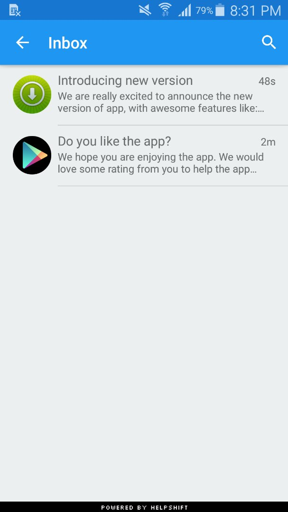

## Data Collection APIs

To start collecting rich meta-data about your user, use the add property APIs:


```as3
Helpshift.instance.campaigns.addBooleanProperty( "is-pro", false );
Helpshift.instance.campaigns.addStringProperty( "user-type", "paid" );
Helpshift.instance.campaigns.addIntProperty( "user-level", 7 );
```


## Inbox APIs

You can use the `showInbox()` API to show a list of In-app Campaign messages that have been received by the user.


```as3
Helpshift.instance.campaigns.showInbox();
```




## Inbox Data APIs

The Helpshift SDK presents a standard android like UI with the `showInbox` API. If your application is styled completely separately and you want to create your custom UI for the list of Campaign messages, the Helpshift SDK provides a set of APIs to power your UI based on the data that the SDK receives.


`getAllInboxMessages` : Return a List of InboxMessage objects which represent the active Campaign messages for the current user. This method does not return any expired campaign.

```as3
var messages:Array = Helpshift.instance.inbox.getAllInboxMessages();
for each (var message:InboxMessage in messages)
{
    trace( "message: " + message.identifier + "["+message.actions.length +"]" );
}
```


More information: https://developers.helpshift.com/android/campaigns/#inbox-data-apis
