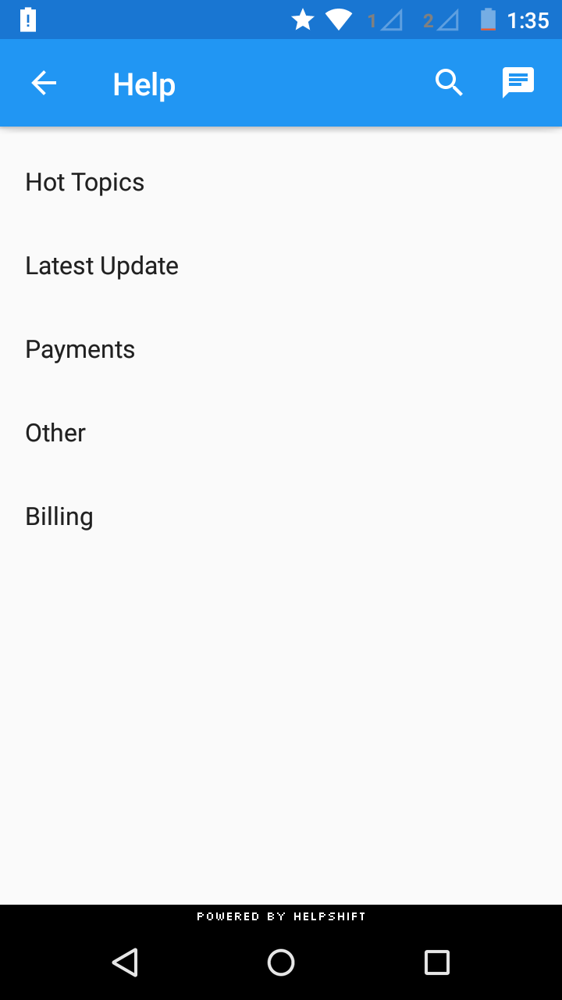
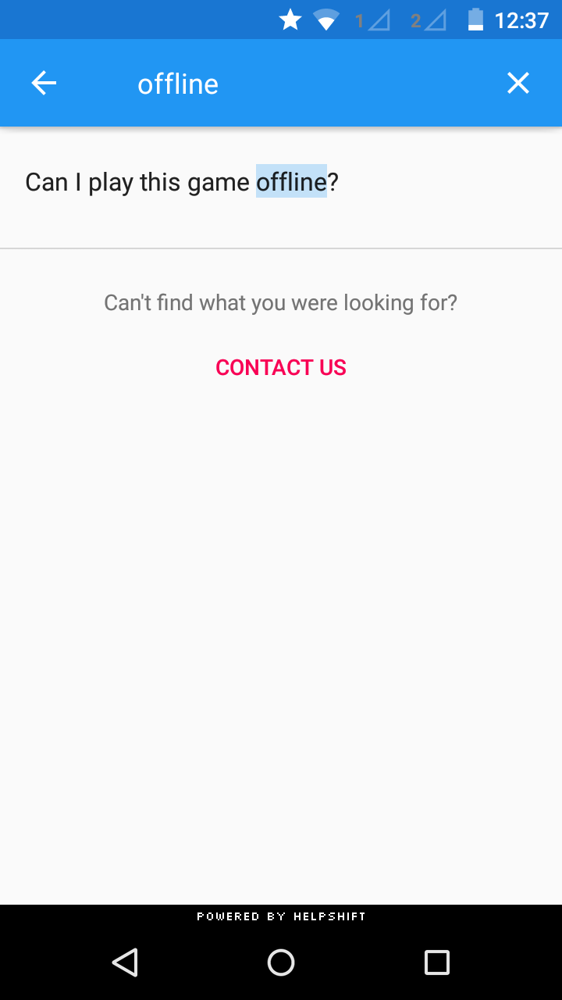
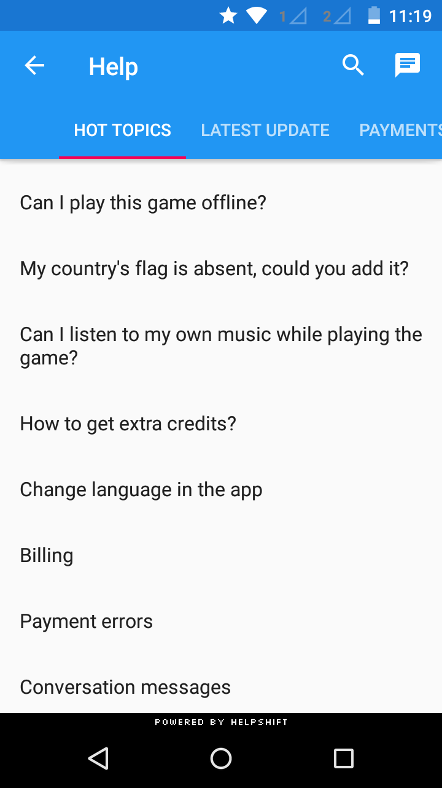
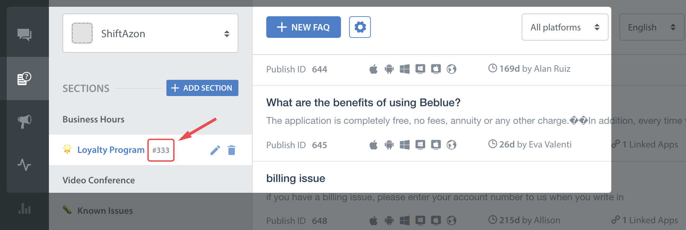
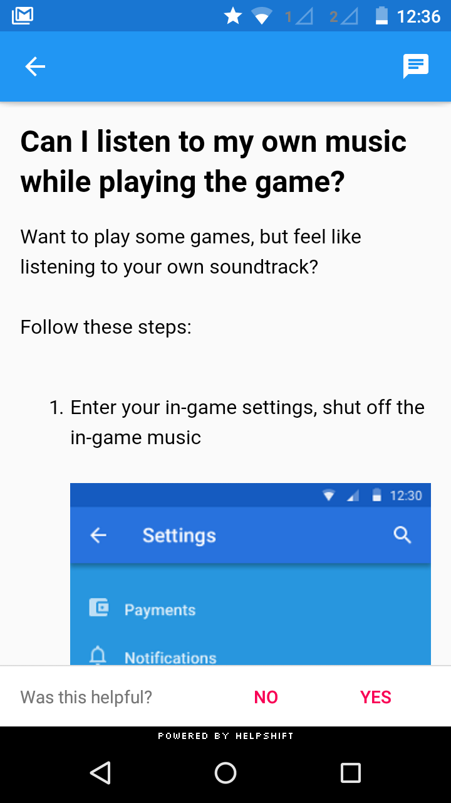
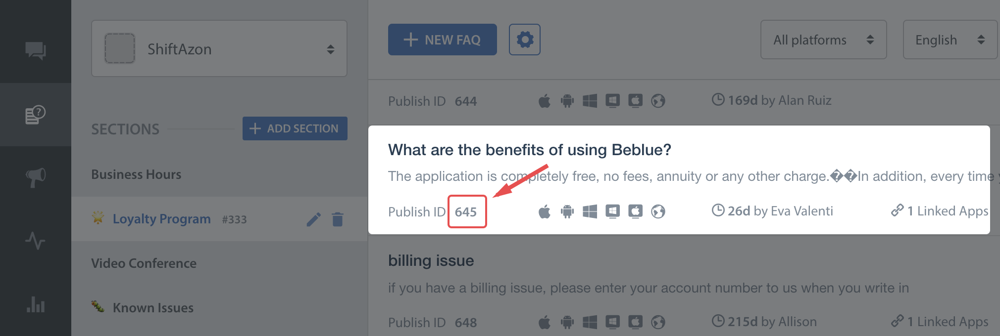

## Integrating Contact Us & In App Messaging

You can use the api call `showConversation()` to provide a way for the user to send feedback or start a new conversation with you. This has been provided if you want to embed a "Send Feedback" or "Contact Us" action in your app and want to lead the user to this action directly without having to go to the FAQ. Once, a user starts a new conversation, this API call will show the conversation activity. The conversation will ensue until it is resolved (and the resolution is accepted by the user) or rejected by the agent.

```as3
Helpshift.instance.support.showConversation();
```


## Integrating FAQs


You can use the api call `showFAQs()` to provide a way for the user to invoke the purpose built help/support section in your app. This is the easiest approach to enable help in your app as it bundles all the capabilities of the Helpshift SDK in a simple and intuitive interface. You can wire this api call to a "Help" or "Support" action in your app. This Activity combines the FAQ, Search and Contact Us functionality together in a single interface. In this view a user has to search for a specific question in the FAQ failing which they can report an issue. When you respond back to their question from the Helpshift Agent Dashboard, the reply will be shown as a count besides Contact Us, clicking on which will open up the conversation.

| | |
| --- | --- |
|  |  |


```as3
Helpshift.instance.support.showFAQs();
```


## FAQ Filtering by tags

Starting v3.11.0 onwards, we have introduced FAQ filtering capability by tags. With the goal of helping the end user see focused & related content e.g. basis the user demographic or device profiles, developers can now choose the new capability for FAQ filtering and showing a focused FAQ list to the right audience. Typical cases why you would want to use FAQ filtering are : You want to show specific FAQs for specific audience. E.g. if you may categorize the users as ‘beginner’, ‘intermediate’ or ‘expert’ based on your business logic You may want to show specific FAQs based on the device. E.g. a set of FAQs for Tablet vs. Phone

FAQ filtering is a 2 step approach:

1. FAQs need to be classified using the issue tags field on the dashboard e.g. tags ‘phone’ & ‘tablet’.
2. Once the FAQs are tagged, they can be filtered at the SDK using the filter options described here


>
> NOTE: Helpshift has 2 types of tags mainly Issue Tags & Search Tags.
> 
> - Issue tags are used to filter the FAQ list on the SDK with the filter rules.
> - Search tags (a.k.a Search Keywords) When performing in-app search, Helpshift SDK gives preference to these keywords. You can also use this to add alternative keywords that users might search for, but which may not exist in the FAQ title or the content.
>


### How to use FAQ filtering

This will be a config option which will be supported by the `showFAQs` and `showFAQSection` APIs:

```as3
// If the developer wants to show all FAQs with tags "tag1" or "tag2"

var config:ApiConfig = new ApiConfig()
        .setWithTagsMatching( new FaqTagFilter( [ FaqTagFilter.OPERATOR_OR ], ["tag1", "tag2"] ) );

Helpshift.instance.support.showFAQs( config );
```

The `setWithTagsMatching` option will take a `FaqTagFilter` object which takes two parameters

 - `operator` : one of FaqTagFilter.Operator.AND, FaqTagFilter.Operator.OR, FaqTagFilter.Operator.NOT which will serve as conditional operators for the given tags
 - `tags` : the actual tags in the query


## Showing a Particular FAQ Section

You can use the api call `showFAQSection()` to show faqs from a particular FAQ section.

```as3
Helpshift.instance.support.showFAQSection( "12" );
```




You will need the publish id of the section:




This feature works like a permalink for displaying specific FAQ sections as context sensitive help in your app. For example, if your app requires the user to login to using email, facebook and twitter, you could wire a help action on the login screen that can link to the Helpshift FAQ section called "Login help" which has several questions related to login methods.


## Showing a Particular FAQ Question

You can use the api call `showSingleFAQ()` to show a single faq question.

```as3
Helpshift.instance.support.showSingleFAQ( "4" );
```



You'll need the publish-id of the FAQ in this case:




## Guided Issue Filing

Guided issue filing is a feature to capture more context when a user interacts with Helpshift Support. For example, lets say you want the user to file a ticket in case of a complaint and also in case he want to suggest a feature. With guided issue filing, you will be able to distinguish between these two use cases and take required actions (like assigning appropriate agents).

Guided Issue Filing can be achieved using Dynamic Forms.

Dynamic Forms also enable better FAQ discovery. Lets say there is a frequently viewed FAQ or FAQ section buried deep in your FAQ hierarchy. Some users might miss it out and opt to file an issue instead. With dynamic forms, you can create a new section (like top FAQs) that links to that FAQ section. Or create and alternate title to an FAQ (like 'How do I pay for gems' instead of 'Billing').

Dynamic Forms are built using one or more Flow types.

1. Flow to show conversation screen
    - similar to the showConversation: API
    - `new ConversationFlow( "Contact Us about our app", new ApiConfig() )`
2. Flow to show all FAQs
    - similar to the showFAQs: API
    - `new FAQsFlow( "FAQs", new ApiConfig() )`
3. Flow to show a FAQ section
    - similar to the showFAQSection: API
    - `new FAQSectionFlow( "FAQ Section", "12", new ApiConfig() )`
4. Flow to show a single FAQ
    - similar to the showSingleFAQ: API
    - `new SingleFAQFlow( "Single FAQ", "4", new ApiConfig() )`


https://developers.helpshift.com/android/support-tools/#dynamic-forms


```as3
var faqSectionFlow:FAQSectionFlow = new FAQSectionFlow( "FAQ Section", "12", new ApiConfig() )
var singleFAQFlow:SingleFAQFlow = new SingleFAQFlow( "Single FAQ", "4", new ApiConfig() )
var showConversationFlow:ConversationFlow = new ConversationFlow( "Contact Us about our app", new ApiConfig() )

var customContactUsFlows:Array = [
        faqSectionFlow,
        singleFAQFlow,
        showConversationFlow
];

var config:ApiConfig = new ApiConfig()
        .setCustomContactUsFlows( customContactUsFlows );

Helpshift.instance.support.showFAQs( config );
```


